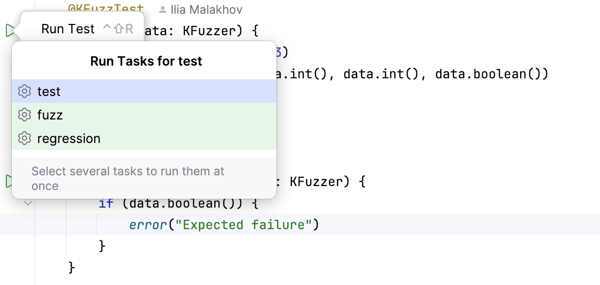

# kotlinx.fuzz

`kotlinx.fuzz` is a general purpose fuzzing library for Kotlin. The library provides basic functionality:

* Simple API for writing fuzz tests
* Gradle plugin that provides an easy way of configuring the fuzzer, running it, and generating reports
* Custom JUnit engine that handles interactions with the fuzzing engine and allows for easy integration with IDE
* Integration with Jazzer as the main fuzzing engine for now

## Requirements

Currently, `kotlinx.fuzz` works only for JVM and requires JDK 8.

## Usage

1. Add PLAN lab maven repository to your gradle config:

`build.gradle.kts`:
```kotlin
repositories {
    maven(url = "https://plan-maven.apal-research.com")
}
```
`settings.gradle.kts`:
```kotlin
pluginManagement {
    repositories {
        maven(url = "https://plan-maven.apal-research.com")
    }
}
```


2. Add `kotlinx.fuzz` as a dependency:
```kotlin
dependencies {
    testRuntimeOnly("org.jetbrains:kotlinx.fuzz.jazzer:0.1.0")
}
```

3. Apply `kotlinx.fuzz` plugin to your project:
```kotlin
plugins {
    id("kotlinx.fuzz.gradle") version "0.1.0"
}
```

4. Configure plugin:
```kotlin
fuzzConfig {
    instrument = listOf("org.example.**")
    maxSingleTargetFuzzTime = 10.seconds
}
```

5. Write your fuzz tests:
```kotlin
package org.example

import kotlinx.fuzz.KFuzzTest
import kotlinx.fuzz.KFuzzer

object ExampleTest {
    @KFuzzTest
    fun foo(data: KFuzzer) {
        if (data.int() % 2 == 0) {
            if (data.int() % 3 == 2) {
                if (data.int() % 31 == 11) {
                    throw IllegalArgumentException()
                }
            }
        }
    }
}
```

6. Run fuzzer:
```bash
~/example » ./gradlew fuzz                                                                                                                                                  1 ↵

> Task fuzz

SampleTarget > public final void org.example.ExampleTest.foo(kotlinx.fuzz.KFuzzer) FAILED
    java.lang.IllegalArgumentException
        at org.example.ExampleTest.foo(ExampleTest.kt:12)
```

7. Check the fuzzing report in `build/fuzz`

You can see more examples of `kotlinz.fuzz` usage in [`kotlinx.fuzz.test`](kotlinx.fuzz.test)

## Modes

Currently `kotlinx.fuzz` can run fuzzer in two different modes:

* **Fuzzing** mode &mdash; in this mode `kotlinx.fuzz` will use the fuzzing engine to generate new seeds that explore the program under test, achieve the highest possible coverage and find new crashes. You can run this mode using `./gradlew fuzz` command.
* **Regression** mode &mdash; in this mode `kotlinx.fuzz` does not generate new crashes, it runs your fuzz tests on the seeds that previously triggered crashes. You can run this mode using `./gradlew regression` command. If there are no previously found crashes, running this task will cause the following error:
```
No matching tests found in any candidate test task.
    Requested tests:
        Test pattern *your test name* which fails in task :regression
```

Both of these tasks extend built-in Gradle `test` task, so you can provide additional parameters or running individual fuzz tests using the same Gradle arguments.

`kotlinx.fuzz` test engine also provides integration with IDEs and allows you to run and debug your fuzz tests both in fuzz and regression mode.



## Report structure

`kotlinx.fuzz` will generate `build/fuzz` folder with the fuzzing campaign report. The general structure of the report is following:

* `corpus` folder contains seeds generated by fuzz engine during the fuzzing campaign.
* `coverage` folder contains binary JaCoCo `.exec` files with coverage for each individual fuzz test.
* `jacoco-report` provides a JaCoCo coverage report in human-readable formats: HTML, CSV and XML.
* `logs` contains fuzz engine logs for each of the fuzz tests.
* `reproducers` folder contains crash seeds found by the fuzz engine. This folder is used by `kotlinx.fuzz` during `regression` mode. Each `crash-$hash` file is a unique crash found by the fuzz engine. Additionally, for each crash seed you can find `stacktrace-$hash` file that contains a stack trace of the found crash and `cluster-$hash` folder that contains all the other seeds that reproduce the same failure (you can read about in more in [Crash deduplication](docs/Crash%20deduplication.md)).
* `stats` contains fuzz engine's CSV reports for each individual fuzz test. CSV files contain information about number of executions, number of found crashes, coverage, etc.
* `merged-coverage.exec` &mdash; JaCoCo binary file with the merged coverage of all the fuzz tests (this binary file is used to generate `jacoco-report` folder).
* `overall-stats.csv` &mdash; final CSV report of Jazzer for each of the fuzz tests.

## Configuration options

TODO

## Differences from Jazzer

`kotlinx.fuzz` uses Jazzer as the main fuzzing engine, but also introduces several new key features:

* Improved and simplified API
* Gradle plugin that integrates all the fuzzing-related tasks into your build system
  * Easy configuration
  * Verification of configuration options
* Improved crash deduplication algorithm
* Improved regression mode

## Trophy list

Trophy list can be found [here](docs/Trophy%20list.md)
